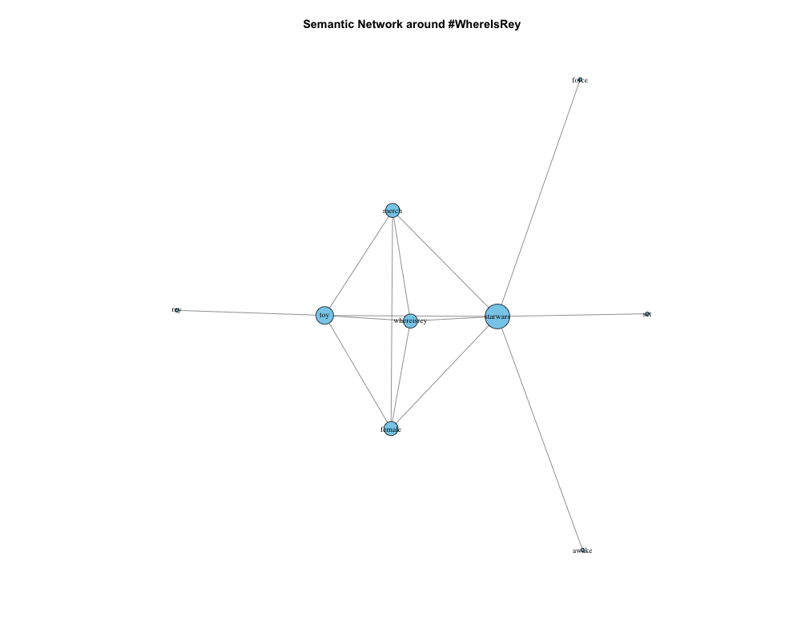
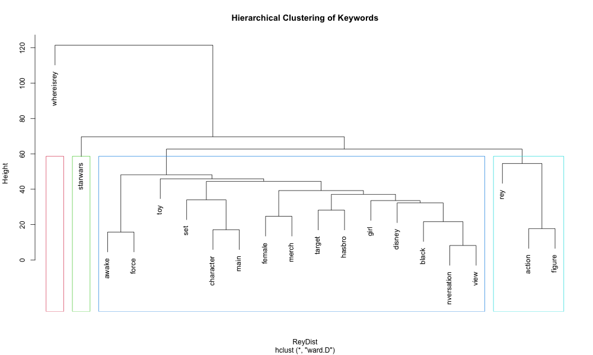

# #WhereIsRey Public Opinion Analysis: A Semantic Network Approach

## 1. Background
In 2015, Star Wars: The Force Awakens was released, but merchandise featuring the female protagonist Rey was notably absent during the holiday season. This sparked a large-scale consumer protest on Twitter under the hashtag #WhereIsRey. This project uses **semantic network analysis** to uncover the core issues discussed by consumers and how they are connected.

## 2. Methods & Tools
- **Stack**: R language
- **Key packages**: `tm` (text cleaning), `igraph` (network analysis), `wordcloud`, `RColorBrewer`
- **Workflow**:
  1. Text preprocessing (cleaning, stemming, stopword removal)
  2. Build Term-Document Matrix
  3. Identify word associations using `findAssocs`
  4. Construct and visualize a two-layer semantic network
  5. Hierarchical clustering to identify topics

## 3. Key Findings

### 3.1 Semantic Network Graph


**Interpretation**:
- `toy`, `girl`, `disney`, `hasbro` are at the center of the network.
- `sexism` acts as a bridge connecting `girl` and `disney`.
- This indicates that consumer criticism was directed at **specific companies and products**, and escalated into a critique of **brand values**.

### 3.2 Topic Clustering Dendrogram


**Interpretation**:
- Keywords can be clustered into 4 main topics.
- Rectangles highlight automatically grouped themes.

## 4. Conclusion & Implications
The conversation evolved from a specific product issue (missing merchandise) to a value-based issue (gender representation). For corporate crisis management, this highlights the need to:
- Establish real-time social listening.
- Track how discussion topics evolve.
- Respond to value-based concerns when they arise.

## 5. How to Reproduce
```r
# 1. Install required packages
install.packages(c('tm', 'igraph', 'wordcloud', 'RColorBrewer'))

# 2. Run the analysis script
source('analysis.R')